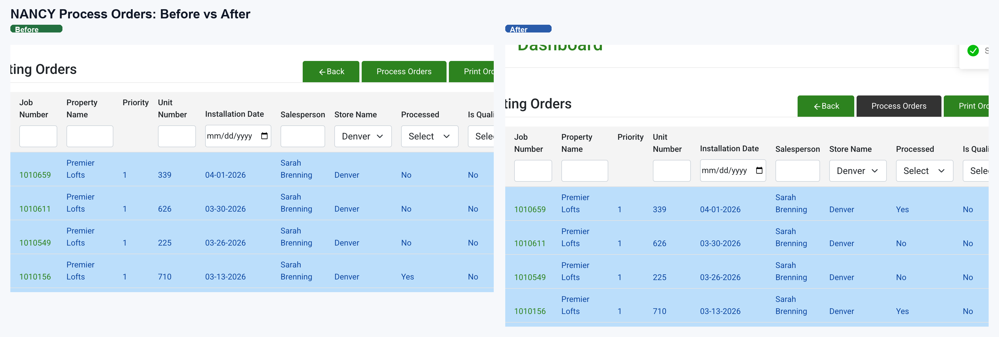

# Customer Priority Feature — NANCY QA Report

**Scope:** NANCY only. This report covers the NANCY admin screen, import flow, Existing Orders visuals, and `Process Orders` / local BC-mock behavior. Scheduler verification is tracked separately in [QA-Report-Scheduler-Customer-Priority.md](./QA-Report-Scheduler-Customer-Priority.md).
**Feature branches:** `feature/customer_priority` (`GeoffERP-API @ 9ae4edf9`, `Geoff-ERP @ d1d468b`)
**QA environment:** Local NANCY on this machine. Core path services are up; `sqlserver`, `auth-proxy`, `d365bc-mock`, and `minio` report `healthy`, while `api`, `caddy`, `ordering-web`, and `seaming-web` are up without Docker healthchecks.
**Tested by:** Codex (Chrome MCP + API curl + local logs / DB spot checks)
**Refresh date:** 2026-04-22 (MDT)
**Status:** **AMBER — the NANCY admin/import path is working locally, but the current live 8-order BC proof still shows the release batch arriving in the reverse of the visible ordered payload.**

---

## 1. What Changed

### 1.1 Business goal
Let the sales office tell NANCY / BC which customers should be prioritized for material allocation when several jobs are released at the same time. The current NANCY feature contract is:

1. **NEW customers** are properties created within the configured **New Customer Window** and still within the configured **Order Threshold**.
2. **Priority customers** are properties on the uploaded VIP list for their store that do **not** meet the NEW rule.
3. Everyone else renders and sorts normally.

Default settings on this local environment:
- `New Customer Window (days) = 60`
- `Order Threshold = 7`
- `Feature enabled (master) = ON`
- `Emit scheduler fields = ON`

### 1.2 Admin screen: Customer Priority
Admins manage Customer Priority at `/customer-priority`.

Per-store list behavior:
- Upload is **wipe-and-replace** for the selected store.
- Import deduplicates by trimmed, case-insensitive property name.
- The current demo state uses the real workbook import from `Customer Tier-Priority Import Actual.xlsx`: `169 imported`, `24 skipped`, and `14 duplicates removed`.
- The top Denver rows include `Premier Lofts = 1`, `Park 146 = 5`, `TAVA Waters = 16`, and `The Lookout at Broadmoor = 21`.

Global settings behavior:
- **Feature enabled (master)**: master kill switch for Existing Orders coloring, default sort, and Process Orders ordering behavior.
- **Emit scheduler fields**: still exists on the NANCY screen and still controls the API payload shape, but downstream Scheduler behavior is out of scope for this report.
- **New Customer Window (days)** and **Order Threshold**: runtime rule parameters persisted in the DB and applied on the next request.
- The page shows **Last changed** from the DB-backed settings row.

### 1.3 Existing Orders visual cues
The Existing Orders grid includes a **Priority** column and row tinting:

| Rule | Row color | Badge / value |
|---|---|---|
| Property meets current NEW rule | `rgb(255, 224, 178)` | `NEW` |
| Property is store-priority and not NEW | `rgb(187, 222, 251)` | Priority number (`1`, `2`, ...) |
| Insufficient material | red font | pre-existing behavior |
| Everyone else | no tint | blank |

Precedence remains:
- `NEW` orange
- Priority blue
- pre-existing red shortage text remains visible
- none

When master is OFF:
- default sort reverts to legacy
- UI coloring / default priority behavior reverts to legacy

### 1.4 Process Orders / BC release behavior
There are now two separate pieces of evidence for the NANCY release path:

1. **Operator success proof**  
   We re-ran `Process Orders` in the Existing Orders UI for `Premier Lofts` job `1010659`. The row flipped from `Processed = No` to `Processed = Yes`, proving the NANCY action itself is working locally.

2. **8-order BC sequence proof**  
   We sent a clean 8-order Denver / TAVA Waters batch into NANCY and captured the exact order observed by the local BC mock. The ordered payload sent into NANCY was:

   - `1010660`
   - `1010638`
   - `1010626`
   - `1010537`
   - `1010524`
   - `1010498`
   - `1010436`
   - `1009866`

   The BC mock observed:

   - `1009866`
   - `1010436`
   - `1010498`
   - `1010524`
   - `1010537`
   - `1010626`
   - `1010638`
   - `1010660`

   Child orders appended in this proof run: `0`

Current interpretation:
- NANCY is definitely sending the batch to BC locally.
- The local BC mock is definitely recording the sequence it received.
- In the current live local run, the observed BC order is the reverse of the ordered payload sent into NANCY.

### 1.5 Database / migrations
Customer Priority spans two DB objects:

1. **`TR_CustomerPriority`**
   - per-store VIP priority rows
   - current demo state reflects the real Denver workbook import, with top rows including `Premier Lofts = 1` and `Park 146 = 5`

2. **`TR_CustomerPrioritySetting`**
   - single-row global settings table on the current branch
   - currently stores `IsEnabled=true`, `EmitSchedulerFields=true`, `NewCustomerWindowDays=60`, `NewCustomerOrderThreshold=7`

Migration / data-migration set called out in the current branch / handover:
- `20260419180000_AddCustomerPriorityTable`
- `20260419180001_AddCustomerPriorityMenu.sql`
- `20260420180000_AddCustomerPrioritySettingTable`
- `20260420180001_SeedCustomerPrioritySetting.sql`
- `20260420190000_AddCustomerPriorityFlagColumns`

---

## 2. How To Reproduce / Use

### 2.1 One-time setup on this machine
```bash
cd ~/NANCY/local-dev/docker
docker compose -p local-dev up -d
```

Access through Caddy / hosts-based routing:
- `https://dev.s10drd.com`
- `https://dev.api.s10drd.com`

Test login:
- `robert@standardinteriors.com / LocalDev123!`

### 2.2 Admin: review settings and priority list
1. Log in.
2. Go to **Admin** -> **Customer Priority**.
3. Confirm the global settings panel loads.
4. Confirm the selected store is **Denver**.
5. Confirm the imported workbook priorities render in rank order.

Expected current values on this machine:
- master ON
- emit scheduler fields ON
- window `60`
- threshold `7`

### 2.3 Admin: import a priority list
1. On `/customer-priority`, pick the target store.
2. Click **Import CSV**.
3. Supply a CSV/XLSX with:
   - `Property Name`
   - `Management Company`
   - `Priority Number`
4. Click **Save**.

Expected behavior:
- store-scoped wipe-and-replace
- dedup by property name
- list refreshes with the imported rows

Sample CSV:
```csv
Property Name,Management Company,Priority Number
TAVA Waters,BH,1
The Lookout at Broadmoor,ConAm - Lookout at Broadmoor,2
Centennial East Apartments,Mission Rock Residential,3
Redstone Ranch Apartments,NALS - Redstone Ranch,4
The Vue at Spring Creek,Greystar - Vue at Spring Creek,5
```

### 2.4 Sales: inspect Existing Orders
1. Go to **Existing Orders**.
2. Use the **Priority** column to confirm the current state:
   - `NEW` rows are orange
   - store-priority established customers are blue
3. Filter by `TAVA` to see the current blue priority rows.

### 2.5 Sales: process orders and inspect BC proof
1. Select target jobs in **Existing Orders**.
2. Click **Process Orders**.
3. Confirm NANCY returns success and the target row flips to `Processed = Yes`.
4. For batch-order proof, inspect the local BC mock receipt and the raw text evidence:
   - [`08-bc-priority-order-evidence.txt`](./08-bc-priority-order-evidence.txt)
   - [8-order BC proof image](./09-bc-mock-release-proof-8-orders.png)

### 2.6 API reference
All endpoints are behind `[Authorize]` JWT bearer auth.

Current Customer Priority endpoints:

| Method | Path | Notes |
|---|---|---|
| `GET` | `/User/api/CustomerPriority/GetList?storeId={id}` | store-scoped priority rows |
| `POST` | `/User/api/CustomerPriority/Import` | multipart: `file`, `storeId`, `userId` |
| `DELETE` | `/User/api/CustomerPriority/Remove?storeId={id}` | clears a store list |
| `GET` | `/User/api/CustomerPriority/GetSettings` | DB-backed global settings |
| `POST` | `/User/api/CustomerPriority/SaveSettings?userId={id}` | saves master / scheduler / window / threshold |

Current NANCY ordering endpoints used in this QA pass:

| Method | Path | Notes |
|---|---|---|
| `GET` | `/Ordering/api/Order/GetAllOrderInstallationDetail` | Existing Orders grid payload |
| `POST` | `/Ordering/api/Order/SendBulkJobToD365BC` | NANCY Process Orders batch release |

Validation responses retained:
- `storeId <= 0` -> `400 "storeId is required and must be greater than 0"`
- missing file -> `400 "No file uploaded"`

### 2.7 Rollback / ship notes
Rollback now requires more than dropping `TR_CustomerPriority`.

At minimum:
- undo `TR_CustomerPriority`
- undo `TR_CustomerPrioritySetting`
- undo the Apr 20 EF migrations / seed row
- undo the earlier admin menu patch

Deployment / merge note from the current handover:
- expect an `OrderingRepository.cs` conflict against `blue`

---

## 3. Test Evidence

### T1 — Admin menu exposes the screen
The **Customer Priority** button is present in the Admin menu for the seeded admin role.


### T2 — Customer Priority page loads with settings + seeded priorities
Live refresh screenshot from the current environment. The page includes the global settings panel above the imported Denver priority list. The top rows reflect the actual workbook import, starting with `Premier Lofts = 1`.


### T3 — Import CSV modal opens clean
The import modal still opens with the expected file-type hint.


### T4 — File selected state
The existing attached-file screenshot still reflects the modal behavior after file selection.


### T5 — Retained import validation responses

These exact payloads are retained from the earlier API validation pass. They still match the controller-level validation rules on the current branch, but the counts below were not freshly re-run during this markdown split:

| Scenario | HTTP | Body |
|---|---|---|
| Valid CSV (6 rows, 1 duplicate TAVA row) | 200 | `{totalImported:5, totalDuplicates:1, totalSkipped:0}` |
| `storeId=0` | 400 | `"storeId is required and must be greater than 0"` |
| no file | 400 | `"No file uploaded"` |

### T6 — Existing Orders renders orange `NEW` rows
Live DOM verification still reports orange `NEW` rows as `rgb(255, 224, 178)`.


### T7 — Existing Orders renders blue priority rows for TAVA
Live DOM verification during this refresh still reported TAVA rows as `rgb(187, 222, 251)` with the priority value visible in the Priority column.


### T8 — Process Orders succeeds for a live local NANCY row
The local operator proof still stands: `Premier Lofts` job `1010659` can be processed successfully from the Existing Orders screen, and the row flips to `Processed = Yes`.



### T9 — 8-order BC proof captures the exact local release sequence
The current local proof run used a clean 8-order Denver / TAVA Waters batch with no appended child orders.

Observed ordered payload sent into NANCY:
1. `1010660`
2. `1010638`
3. `1010626`
4. `1010537`
5. `1010524`
6. `1010498`
7. `1010436`
8. `1009866`

Observed order at the BC mock:
1. `1009866`
2. `1010436`
3. `1010498`
4. `1010524`
5. `1010537`
6. `1010626`
7. `1010638`
8. `1010660`

Artifacts:
- [`08-bc-priority-order-evidence.txt`](./08-bc-priority-order-evidence.txt)
- [8-order BC proof image](./09-bc-mock-release-proof-8-orders.png)
- [8-order BC proof JSON](./09-bc-mock-stats-after-process-eight.json)

### T10 — Settings load from the DB-backed row
During this refresh:
- live UI showed master ON / scheduler ON / `60` / `7`
- DB-backed API state matched those values
- the page displayed a `Last changed` timestamp sourced from the saved settings row

---

## 4. Regression Checks (current refresh)

| # | Endpoint / Flow | Observed |
|---|---|---|
| R1 | `POST /Authentication/api/Login/SignIn` | works with `robert@standardinteriors.com / LocalDev123!` |
| R2 | `GET /User/api/Roles/GetRoleList` | 13 roles |
| R3 | `GET /User/api/User/GetUser` | 111 users |
| R4 | `GET /User/api/Signup/GetUsers` | 20 |
| R5 | Dashboard UI flow | all five summary widgets still render `500` |
| R6 | Existing Orders grid | `Priority` column present; orange and blue row states confirmed live |
| R7 | `GET /User/api/CustomerPriority/GetList?storeId=12` | imported Denver workbook priorities present; top rows include `Premier Lofts = 1` and `Park 146 = 5` |
| R8 | `GET /User/api/CustomerPriority/GetSettings` | returns ON / ON / `60` / `7` |
| R9 | API logs sample | local-dev noise present; no Customer Priority-specific exception in sampled tail |
| R10 | Local feature path services | core NANCY feature path is available on the current local stack |

Not re-verified during this refresh:
- exact `GetCustomerInfo` count quoted in the older report

---

## 5. Known Limitations & Caveats

1. **Local auth / authorization are still non-production.** `CustomerPriorityController` uses `[Authorize]`, but `RoleAuthorizationFilter` remains commented out locally because the auth-proxy JWT does not carry the production role-access claim. The API working tree also still relies on the local-only HS256 JWT patch in `GEOFF.API/Startup.cs`.

2. **MCP file-upload automation is still limited.** The UI import flow works for real users, but automated browser file upload remains awkward enough that server-side import behavior is the more reliable verification surface here.

3. **The current live 8-order BC proof does not yet match the visible ordered payload.** In the current local run, the BC mock saw the reverse of the ordered payload sent into NANCY. Treat that as the active defect / risk on the NANCY side.

4. **Settings endpoints are not represented in current role metadata.** `GetSettings` and `SaveSettings` exist and work locally, but the current role/menu metadata still only explicitly models `GetList`, `Import`, and `Remove`. This is masked locally because role filtering is disabled.

5. **Automated tests remain deferred.** Unit tests for the corrected new-customer rule and the screen-order-to-BC-order path were not checked in as part of this QA package refresh.

6. **Scheduler verification is intentionally out of scope here.** The separate downstream app now has its own QA handoff in [QA-Report-Scheduler-Customer-Priority.md](./QA-Report-Scheduler-Customer-Priority.md).

---

## 6. Sign-off Checklist

- [x] Current branch / environment metadata refreshed
- [x] Current admin settings panel documented
- [x] Current DB-backed defaults documented
- [x] Existing Orders priority states documented against live UI / DOM
- [x] Current local Process Orders success path documented
- [x] Current 8-order BC proof captured and linked
- [x] NANCY-vs-Scheduler scope split explicitly
- [ ] Live BC order aligned with the visible ordered payload
- [ ] Automated tests added for the current release-order behavior

**Recommendation:** use this report as the NANCY-only source of truth. Treat the current local BC ordering mismatch as the main open issue before broader handoff.
